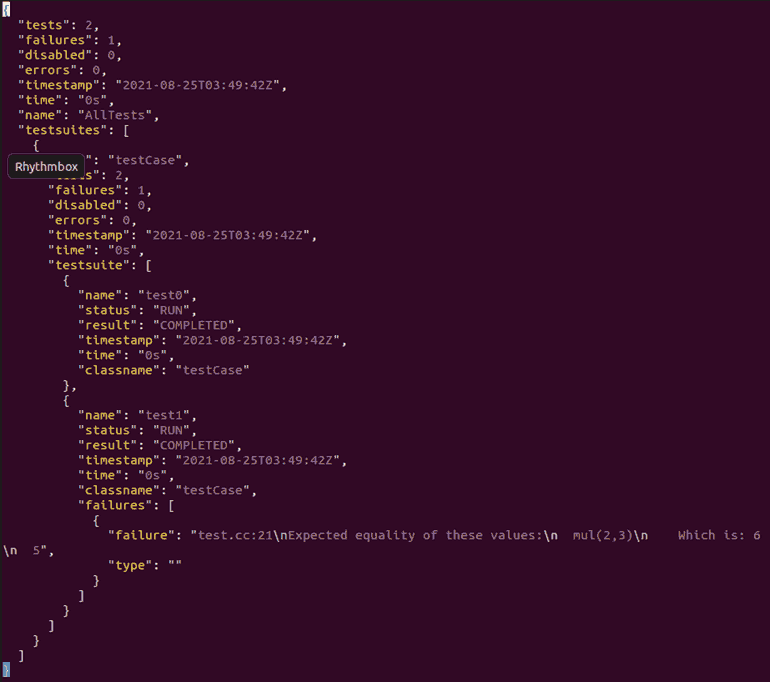

# 1. GoogleTest简介
- GoogleTest（简称GTest）是一个跨平台(Liunx、Mac OS X、Windows当)的C++测试框架，由Google公司发布。GTest测试框架是在不同平台上为编写C++测试而生成的。

- GTest源码<br>
https://github.com/google/googletest

# 2. GTest的安装
- 下载源码
	- git clone https://github.com/google/googletest
- 编译和安装
	- cmake CMakeLists.txt
	- make
		- 生成两个静态库：libgtest.a libgtest_main.a
		- sudo  cp ./lib/libgtest*.a  /usr/lib
		- sudo cp –r ./googletest/include/gtest /usr/include/

# 3. GTest的使用
## 3.1. code
```cpp
#include "gtest.h"

int add(int a, int b)
{
	return a + b;
}

TEST(testCase, test0)
{
	EXPECT_EQ(add(2, 3), 5);
}
TEST(testCase, test1)
{
	EXPECT_EQ(add(2, 3), 6);
}

int main(int argc, char **argv)
{
	testing::InitGoogleTest(&argc, argv);
	return RUN_ALL_TESTS();
}
```
- 增加头文件
	`#include <gtest/gtest.h>`
- 在主函数起始处，添加GTest初始化代码
	`testing::InitGoogleTest(&argc,argv);`
- 启动GTest
	`RUN_ALL_TESTS();`
- TEST是一个宏，定义一个新的测试用例
	第一个参数：当前测试用例归属的测试集名字
	第二个参数：当前测试用例名字

```cpp
TEST(testCase, test_ai_2)
{
	EXPECT_EQ(test_ai_ofile(VS_FALSE, 0, E_AUDIO_BIT_WIDTH_16, E_AUDIO_SOUND_MODE_STEREO), 0);
	EXPECT_EQ(file_compare("AudioTest.aac", "output.pcm"), 0);
	EXPECT_EQ(file_compare ("AudioTest.aac", "ao.pcm"), 0);
	EXPECT_EQ (remove ("output.pcm"), 0);

	eos_reset();
	EXPECT_EQ(test_ai_ofile(VS_FALSE, 0, E_AUDIO_BIT_WIDTH_8, E_AUDIO_SOUND_MODE_STEREO), 0);
	EXPECT_EQ(file_compare("AudioTest.aac", "output.pcm"), 0);
	EXPECT_EQ(file_compare("AudioTest.aac", "ao.pcm"), 0);
}
```

## 3.2. 编译
`g++ -o test test.cc -lgtest -lpthread`

## 3.3. 执行


# 4. 例子
## 4.1. 全部通过

```cpp
#include "gtest.h"

int add(int a, int b)
{
	return a + b;
}

int mul(int a, int b)
{
	return a * b;
}

TEST(testCase, test0)
{
	EXPECT_EQ(add(2, 3), 5);
	EXPECT_EQ(add(4, 3), 7);
}
TEST(testCase, test1)
{
	EXPECT_EQ(mul(2, 3), 6);
	EXPECT_EQ(mul(4, 3), 12);
}

int main(int argc, char **argv)
{
	testing::InitGoogleTest(&argc, argv);
	return RUN_ALL_TESTS();
}
```


## 4.2. 部分通过


## 4.3. 全部失败


# 5. 断言
- ASSERT_系列：如果当前点检测失败则退出当前函数
- EXPECT_系列：如果当前点检测失败则继续往下执行
- bool值检查
	`ASSERT_TRUE(参数)`，期待结果是true
	`ASSERT_FALSE(参数)`，期待结果是false
- 数值型数据检查
	`ASSERT_EQ(参数1，参数2)`，传入的是需要比较的两个数equal
	`ASSERT_NE(参数1，参数2)`，not equal，不等于才返回true
	`ASSERT_LT(参数1，参数2)`，less than，小于才返回true
	`ASSERT_GT(参数1，参数2)`，greater than，大于才返回true
	`ASSERT_LE(参数1，参数2)`，less equal，小于等于才返回true
	`ASSERT_GE(参数1，参数2)`，greater equal，大于等于才返回true
- 字符串检查
	`ASSERT_STREQ(expected_str, actual_str)`，两个C风格的字符串相等才正确返回
	`ASSERT_STRNE(str1, str2)`，两个C风格的字符串不相等时才正确返回
	`ASSERT_STRCASEEQ(expected_str, actual_str)`
	`ASSERT_STRCASENE(str1, str2)`
- EXPECT_系列，也是具有类似的宏结构的

# 6. GTest的事件机制
- TestSuite事件
	需要写一个类，继承testing::Test，然后实现两个静态方法：SetUpTestCase 方法在第一个TestCase之前执行；TearDownTestCase方法在最后一个TestCase之后执行。
- TestCase事件
	是挂在每个测试用例执行前后的，需要实现的是SetUp方法和TearDown方法。SetUp方法在每个TestCase之前执行；TearDown方法在每个TestCase之后执行。
- 全局事件
	要实现全局事件，必须写一个类，继承testing::Environment类，实现里面的SetUp和TearDown方法。SetUp方法在所有测试用例执行前执行；TearDown方法在所有测试用例执行后执行。

## 6.1. TestSuite事件

## 6.2. TestCase事件

```cpp
class Link
{
public:
	int add(int a, int b) {
		return a + b;
	}
	int mul(int a, int b) {
		return a * b;
	}
};

class TestLink:public testing::Test
{
public:
	virtual void SetUp()
	{
		cout << "SetUp" << endl;
	}
	virtual void TearDown()
	{
		cout << "TearDown" << endl;
	}
	Link link;
};

TEST_F(TestLink, add_0)
{
	EXPECT_EQ(link.add(1, 2), 3);
}

TEST_F(TestLink, mul_0)
{
	EXPECT_EQ(link.mul(1, 2), 3);
}

TEST_F(TestLink, mix_0)
{
	EXPECT_EQ(link.mul(1, 2), 2);
	EXPECT_EQ(link.add(1, 2), 3);
}

int main(int argc, char **argv)
{
	testing::InitGoogleTest(&argc, argv);
	return RUN_ALL_TESTS();
}
```

```
$ ./test.exe
[==========] Running 3 tests from 1 test suite.
[----------] Global test environment set-up.
[----------] 3 tests from TestLink
[ RUN      ] TestLink.add_0
SetUp
TearDown
[       OK ] TestLink.add_0 (0 ms)
[ RUN      ] TestLink.mul_0
SetUp
test.cpp:87: Failure
Expected equality of these values:
  link.mul(1, 2)
    Which is: 2
  3
TearDown
[  FAILED  ] TestLink.mul_0 (0 ms)
[ RUN      ] TestLink.mix_0
SetUp
TearDown
[       OK ] TestLink.mix_0 (0 ms)
[----------] 3 tests from TestLink (0 ms total)

[----------] Global test environment tear-down
[==========] 3 tests from 1 test suite ran. (0 ms total)
[  PASSED  ] 2 tests.
[  FAILED  ] 1 test, listed below:
[  FAILED  ] TestLink.mul_0

 1 FAILED TEST
```

## 6.3. 全局事件


# 7. TEST与TEST_F
- `TEST`宏的作用是创建一个简单测试，它定义了一个测试函数，在这个函数里可以使用任何C++代码并使用提供的断言来进行检查。
- `TEST_F`提供了一个初始化函数（`SetUp`）和一个清理函数(`TearDown`)，在`TEST_F`中使用的变量可以在初始化函数`SetUp`中初始化，在`TearDown`中销毁，并且所有的`TEST_F`是互相独立的，都是在初始化以后的状态开始运行，一个`TEST_F`不会影响另一个`TEST_F`所使用的数据

# 8. TestSuite
- 一个test suite包括一个或多个tests。可以将多个tests分组到test suite中，以此反映所测试代码的结构。当一个test suite中的多个tests需要共享一些通用对象和子程序时，可将其放入一个test fixture class。
- 一个test program可包含多个test suites.

# 9. GTest的死亡测试
- 这里的”死亡”指的是程序的奔溃。通常在测试的过程中，我们需要考虑各种各样的输入，有的输入可能直接导致程序奔溃，这个时候我们就要检查程序是否按照预期的方式挂掉，这也就是所谓的“死亡测试”。
- 死亡测试所用到的宏：
    - `ASSERT_DEATH(参数1，参数2)`，程序挂了并且错误信息和参数2匹配，此时认为测试通过。如果参数2为空字符串，则只需要看程序挂没挂即可
    - `ASSERT_EXIT(参数1，参数2，参数3)`，语句停止并且错误信息和被提前给的信息匹配。


# 10. 常用可选项
- `--gtest_list_tests`：列出所有的可选项
    
- `--gtest_filter=POSTIVE_PATTERNS[-NEGATIVE_PATTERNS]`
    - 过滤测试用例（“-”为排除）
    - '?' single character;  '*’ substring;  ':' separates two patterns. 
    
- `--gtest_repeat=number`
    - 所选测试用例循环测试次数设置
    
- `--gtest_shuffle`：乱序测试
- `--gtest_fail_fast`: 测试失败就退出，不再继续往下测
- `--gtest_output=[xml|json] [:DIRECTORY_PATH/|:FILE_PATH]`
    - 产生XML测试报告
    - `FILE_PATH`缺省为`test_details.xml`
    
    

# 11. 临时禁止一个测试用例
- 在`testname`前加前缀`DISABLED`
- 或者加在`TestSuite`前缀`DISABLED`，禁止整个测试集
- `--gtest_also_run_disabled_tests`：临时使能被禁测试用例

```cpp
// Test that Foo does Abc.
TEST(FooTest, DISABLE_DoesAbc) { ... }

class DISABLE_BarTest : public testing::Test { ... };

// Test that Bar does Xyz.
TEST_F(DISABLE_BarTest, DoesXyz) { ... }
```

# 12. 参考资料
- Build Guide:
    - https://github.com/google/googletest/blob/master/googletest/README.md
- Primer Guide:
    - https://github.com/google/googletest/blob/master/googletest/docs/primer.md
- Advanced Guide:
    - https://github.com/google/googletest/blob/master/googletest/docs/advanced.md


# 13. usage
显示某个测试套下所有用例
./foo_test.exe --gtest_list_tests --gtest_filter=[FooSuit].*