# 1. GoogleTest简介
- GoogleTest（简称GTest）是一个跨平台(Liunx、Mac OS X、Windows当)的C++测试框架，由Google公司发布。GTest测试框架是在不同平台上为编写C++测试而生成的。

- GTest源码<br>
https://github.com/google/googletest

# 2. GTest的安装
- 下载源码
	- git clone https://github.com/google/googletest
- 编译和安装
	- cmake CMakeLists.txt
	- make
		- 生成两个静态库：libgtest.a libgtest_main.a
		- sudo  cp ./lib/libgtest*.a  /usr/lib
		- sudo cp –r ./googletest/include/gtest /usr/include/

# 3. GTest的使用
## 3.1. code
```c++
#include "gtest.h"

int add(int a, int b)
{
	return a + b;
}

TEST(testCase, test0)
{
	EXPECT_EQ(add(2, 3), 5);
}
TEST(testCase, test1)
{
	EXPECT_EQ(add(2, 3), 6);
}

int main(int argc, char **argv)
{
	testing::InitGoogleTest(&argc, argv);
	return RUN_ALL_TESTS();
}
```
- 增加头文件
#include <gtest/gtest.h>
- 在主函数起始处，添加GTest初始化代码
testing::InitGoogleTest(&argc,argv);
- 启动GTest
RUN_ALL_TESTS();
- TEST是一个宏，定义一个新的测试用例
第一个参数：当前测试用例归属的测试集名字
第二个参数：当前测试用例名字


## 3.2. 编译
`g++ -o test test.cc -lgtest -lpthread`

## 3.3. 执行
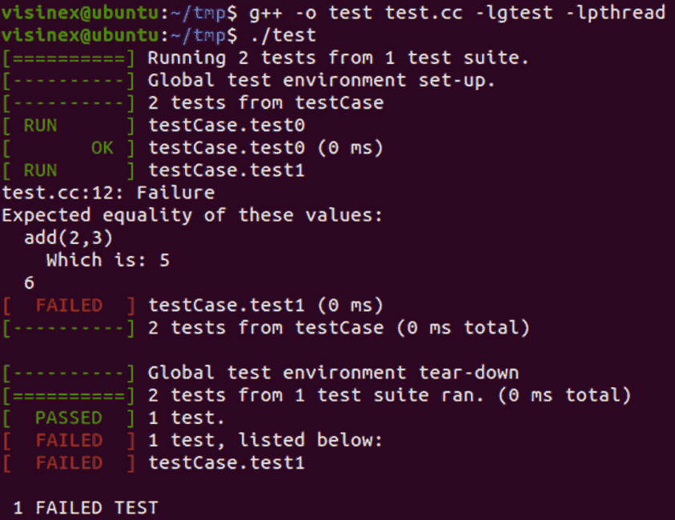


# 4. 例子
## 4.1. 全部通过
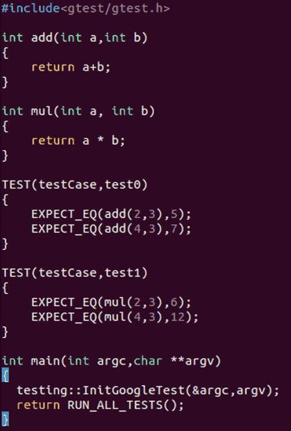

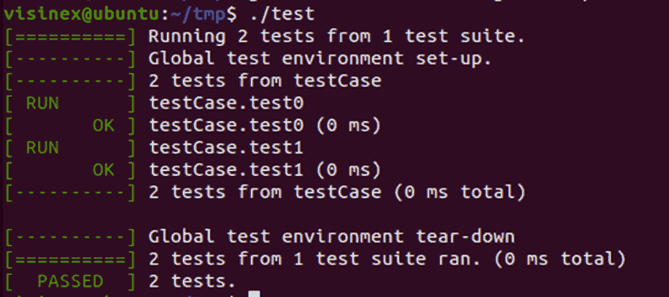


## 4.2. 部分通过
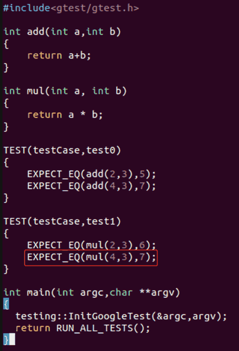

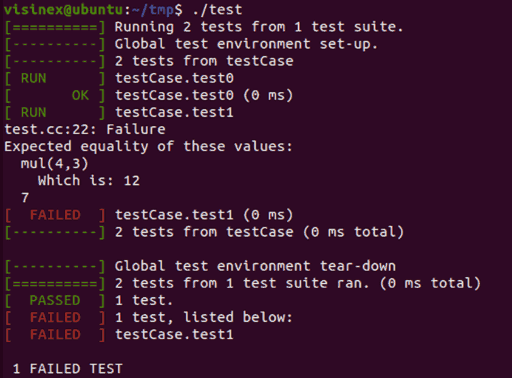

## 4.3. 全部失败
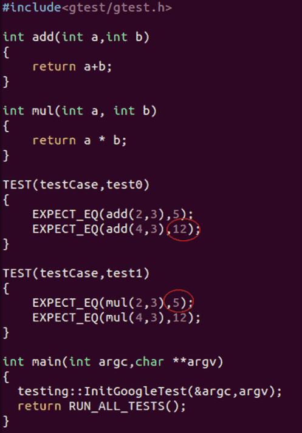
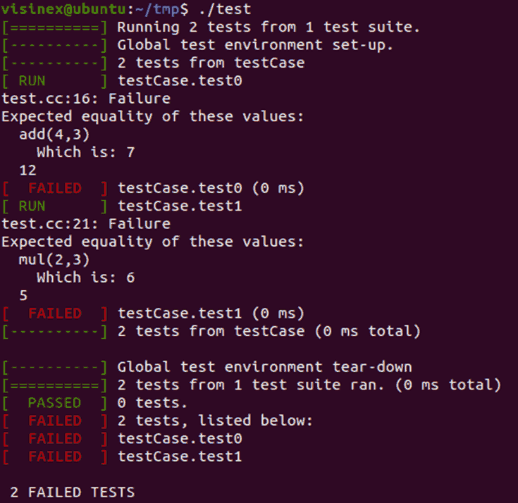

# 5. 断言
- ASSERT_系列：如果当前点检测失败则退出当前函数
- EXPECT_系列：如果当前点检测失败则继续往下执行
- bool值检查
ASSERT_TRUE(参数)，期待结果是true
ASSERT_FALSE(参数)，期待结果是false
- 数值型数据检查
ASSERT_EQ(参数1，参数2)，传入的是需要比较的两个数 equal
ASSERT_NE(参数1，参数2)，not equal，不等于才返回true
ASSERT_LT(参数1，参数2)，less than，小于才返回true
ASSERT_GT(参数1，参数2)，greater than，大于才返回true
ASSERT_LE(参数1，参数2)，less equal，小于等于才返回true
ASSERT_GE(参数1，参数2)，greater equal，大于等于才返回true
- 字符串检查
ASSERT_STREQ(expected_str, actual_str)，两个C风格的字符串相等才正确返回
ASSERT_STRNE(str1, str2)，两个C风格的字符串不相等时才正确返回
ASSERT_STRCASEEQ(expected_str, actual_str)
ASSERT_STRCASENE(str1, str2)
- EXPECT_系列，也是具有类似的宏结构的

# 6. GTest的事件机制
- TestSuite事件
需要写一个类，继承testing::Test，然后实现两个静态方法：SetUpTestCase 方法在第一个TestCase之前执行；TearDownTestCase方法在最后一个TestCase之后执行。
- TestCase事件
是挂在每个测试用例执行前后的，需要实现的是SetUp方法和TearDown方法。SetUp方法在每个TestCase之前执行；TearDown方法在每个TestCase之后执行。
- 全局事件
要实现全局事件，必须写一个类，继承testing::Environment类，实现里面的SetUp和TearDown方法。SetUp方法在所有测试用例执行前执行；TearDown方法在所有测试用例执行后执行。

## 6.1. TestSuite事件

## 6.2. TestCase事件
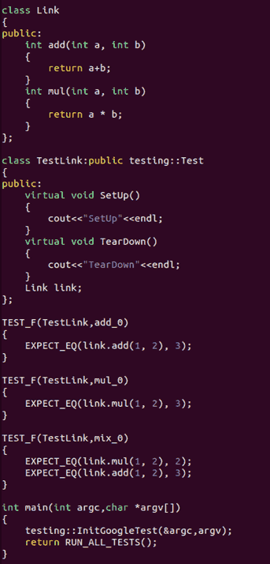
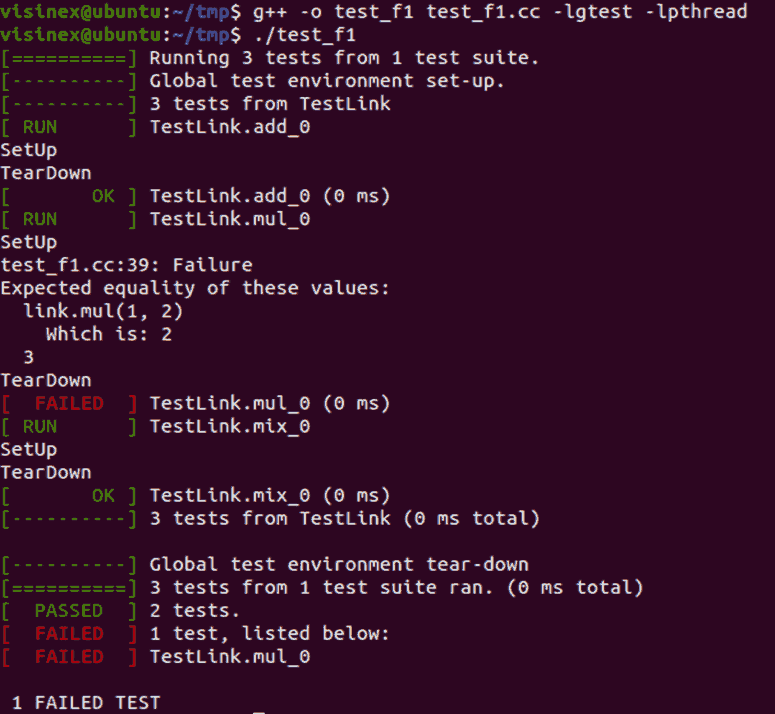

## 6.3. 全局事件
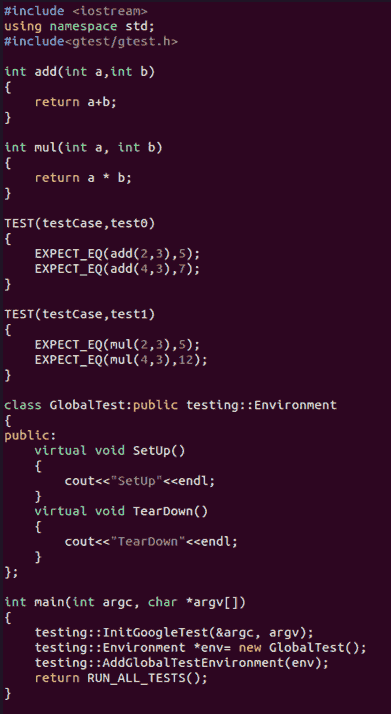

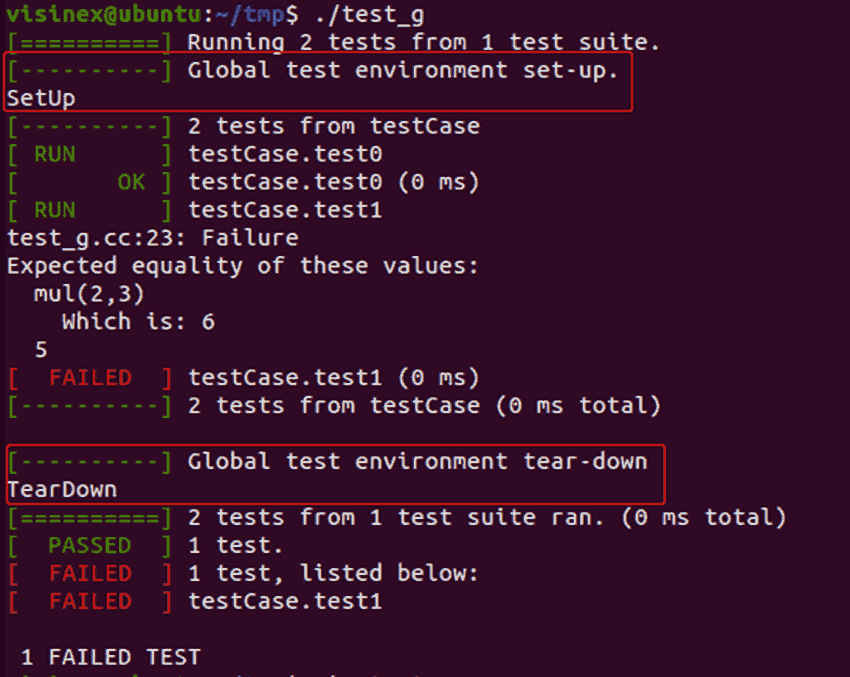

# 7. TEST与TEST_F
- TEST宏的作用是创建一个简单测试，它定义了一个测试函数，在这个函数里可以使用任何C++代码并使用提供的断言来进行检查。
- TEST_F提供了一个初始化函数（SetUp）和一个清理函数(TearDown)，在TEST_F中使用的变量可以在初始化函数SetUp中初始化，在TearDown中销毁，并且所有的TEST_F是互相独立的，都是在初始化以后的状态开始运行，一个TEST_F不会影响另一个TEST_F所使用的数据

# 8. TestSuite
- 一个test suite包括一个或多个tests。可以将多个tests分组到test suite中，以此反映所测试代码的结构。当一个test suite中的多个tests需要共享一些通用对象和子程序时，可将其放入一个test fixture class。
- 一个test program可包含多个test suites.

# 9. GTest的死亡测试
- 这里的”死亡”指的是程序的奔溃。通常在测试的过程中，我们需要考虑各种各样的输入，有的输入可能直接导致程序奔溃，这个时候我们就要检查程序是否按照预期的方式挂掉，这也就是所谓的“死亡测试”。
- 死亡测试所用到的宏：
    - ASSERT_DEATH(参数1，参数2)，程序挂了并且错误信息和参数2匹配，此时认为测试通过。如果参数2为空字符串，则只需要看程序挂没挂即可
    - ASSERT_EXIT(参数1，参数2，参数3)，语句停止并且错误信息和被提前给的信息匹配。
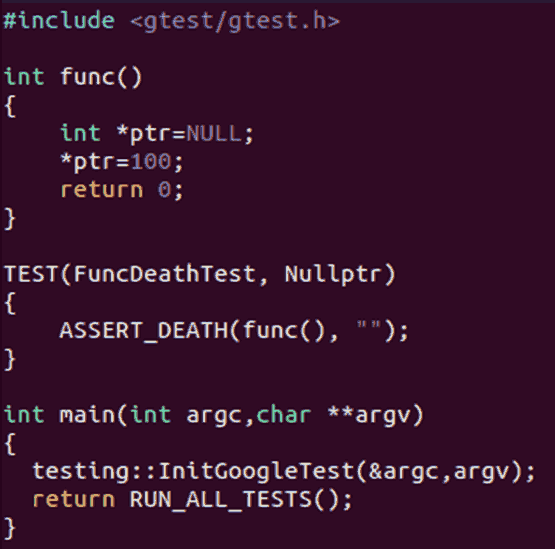
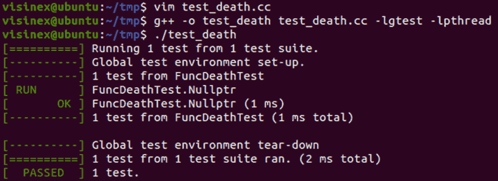

# 10. 常用可选项
- --gtest_list_tests：列出所有的可选项
    
- -- gtest_filter=POSTIVE_PATTERNS[-NEGATIVE_PATTERNS]
    - 过滤测试用例（“-”为排除）
    - '?' single character;  '*’ substring;  ':' separates two patterns. 
    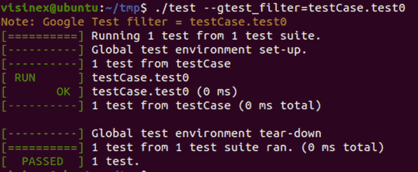
- --gtest_repeat=number
    - 所选测试用例循环测试次数设置
    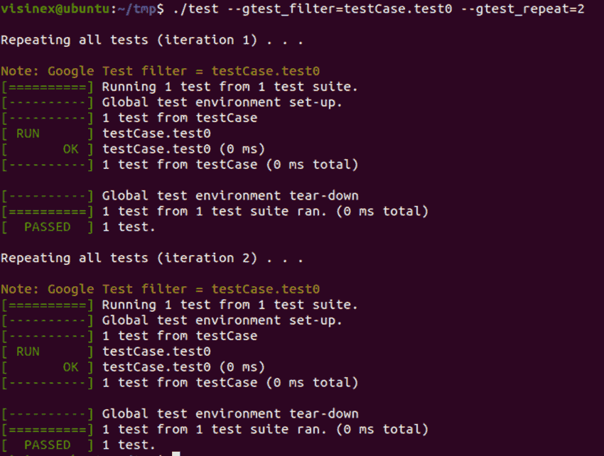
- --gtest_shuffle：乱序测试
- --gtest_fail_fast: 测试失败就退出，不再继续往下测
- --gtest_output=[xml|json] [:DIRECTORY_PATH/|:FILE_PATH]
    - 产生XML测试报告
    - FILE_PATH缺省为test_details.xml
    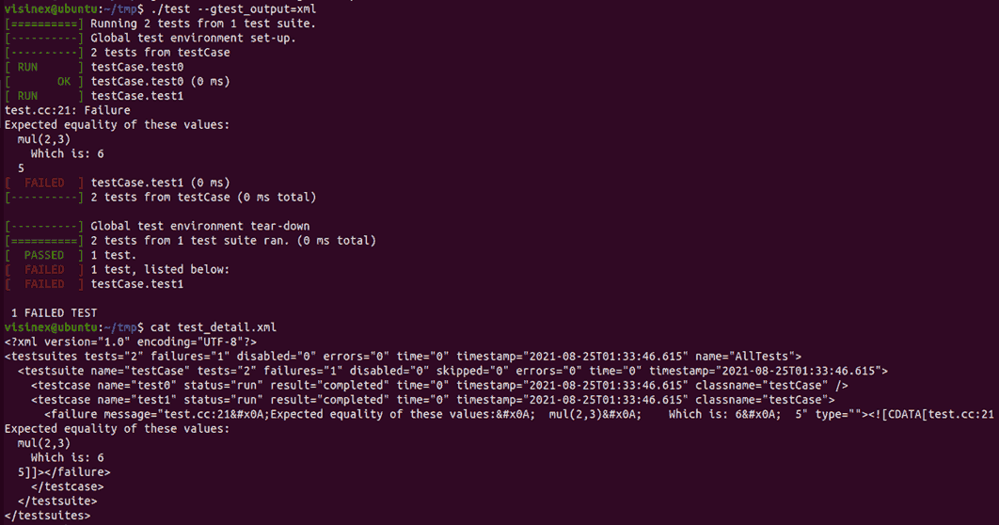
    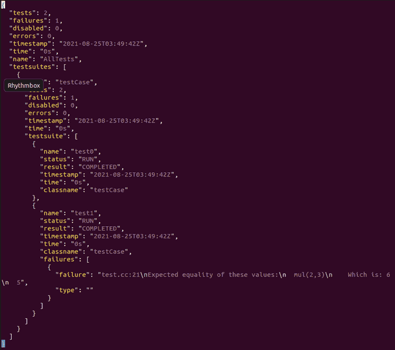

# 11. 临时禁止一个测试用例
- 在testname前加前缀DISABLED
- 或者加在TestSuite前缀DISABLED，禁止整个测试集
- --gtest_also_run_disabled_tests：临时使能被禁测试用例


# 12. 参考资料
- Build Guide:
    - https://github.com/google/googletest/blob/master/googletest/README.md
- Primer Guide:
    - https://github.com/google/googletest/blob/master/googletest/docs/primer.md
- Advanced Guide:
    - https://github.com/google/googletest/blob/master/googletest/docs/advanced.md


# 13. usage
显示某个测试套下所有用例
./foo_test.exe --gtest_list_tests --gtest_filter=[FooSuit].*